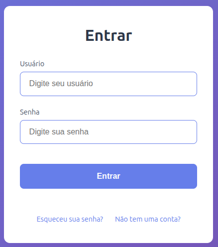

# AuthFlow - Sistema de Autenticação Simples e Moderno

Sistema básico de autenticação com páginas de **Login**, **Registro** e **Recuperação de senha**, com design clean, moderno e responsivo.



## ✨ Funcionalidades

- Interface moderna e responsiva
- Tema gradiente roxo-azulado agradável
- Páginas completas:
  - Login (usuário + senha)
  - Cadastro (usuário, e-mail, senha + confirmação)
  - Recuperação de senha (envio de e-mail)
- Boa acessibilidade (labels associadas, aria-labels, foco visível)
- Validações básicas nativas do HTML5
- Transições suaves, hover e foco agradáveis
- CSS organizado com variáveis e design system simples

## 🚀 Tecnologias Utilizadas

- HTML5
- CSS3 (variáveis CSS, Flexbox, Grid)
- Formulários preparados para envio POST (prontos para backend)

## 📁 Estrutura do Projeto
    authflow/
            ├── login.html
            ├── register.html
            ├── forgot.html
            ├── static/
            │   └── index.css
            └── README.md

## 🎨 Paleta de Cores

| Cor              | Hex       | Uso                          |
|------------------|-----------|------------------------------|
| Primary          | #667eea   | Botões, bordas, links        |
| Primary Dark     | #5a67d8   | Hover / active               |
| Text Principal   | #2d3748   | Textos principais            |
| Text Secundário  | #4a5568   | Labels e textos menores      |
| Fundo gradiente  | #667eea → #764ba2 | Background da página   |

## 🖥️ Como Usar / Testar

1. Clone o repositório

```bash
git clone https://github.com/SEU_USUARIO/authflow.git
